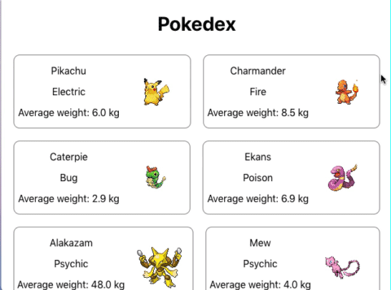

# EXERCÍCIOS

Você vai implementar de forma simplificada uma Pokedex!! Para os que não estão familiarizados com o universo Pokemon, a Pokedex é uma enciclopédia de todos os pokemons na natureza. Para o seu caso, a sua aplicação precisa mostrar todos os pokemons presentes no arquivo **data.js**.

Você pode usar a imaginação para estilizar a sua aplicação. Entretanto, é obrigatório que você implemente pelo menos estes dois componentes:

1. **Pokemon:** como o próprio nome diz, esse componente representa um pokemon. Esse componente recebe como entrada um objeto que contém informações referentes a um pokemon específico. Esse componente precisa retornar as seguintes informações obrigatórias para serem mostradas para quem usar a aplicação, essas informações devem ser validadas utilizando `PropTypes`:

- nome do pokemon;
- tipo do pokemon;
- peso médio do pokemon, acompanhado da unidade de medida usada;
- imagem do pokemon.

2. **Pokedex:** esse componente representa a enciclopédia de pokemons. Esse componente recebe como entrada uma lista de pokemons para serem mostrados na tela. Para cada um desses pokemons recebidos, Pokedex chama o componente Pokemon.

_*Segue uma sugestão de implementação da aplicação:*_

