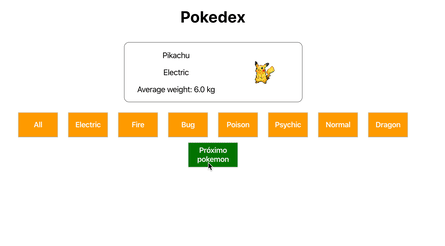

# EXERCÍCIOS

Neste exercício você vai incrementar funcionalidades a sua Pokedex criada no bloco 10 utilizando o **state**.

1. Altere a sua página para que, ao invés de exibir toda a lista de pokémons, ela exiba um pokémon por vez. Ao apertar um botão de Próximo pokémon, a página passa a exibir o próximo pokémon da lista, e depois o próximo, e assim sucessivamente. Ao se chegar ao último pokémon da lista, a Pokedex deve voltar para o primeiro pokémon no apertar do botão;

2. Sua Pokedex deve ter dois botões contendo os tipos Fire e Psychic. A partir dessa seleção, a Pokedex deve circular somente pelos pokémons daquele tipo. Quando a página carrega, um desses filtros deve estar selecionado.

### BÔNUS

1. Separe os estilos de CSS por componente, fazendo um arquivo **.css** para cada;

2. Sua Pokedex deve ter um terceiro botão chamado _"All"_ para redefinir o filtro. Após clicá-lo, a Pokedex deve voltar a circular por todos os pokémons. Quando a página carrega, o filtro selecionado deve ser o _"All"_;

3. Crie um componente `Button` e use-o para fazer os botões reutilizáveis da sua Pokedex;

4. Faça os botões de filtragem serem dinâmicos: sua Pokedex deve gerar um botão de filtragem para cada tipo de pokémon disponível nos dados, independente de quais ou quantos sejam, sem repetição de tipos. Ou seja, se sua Pokedex possui pokémons do tipo Fire, Psychic, Electric e Normal, deve aparecer como opção de filtro um botão para cada um desses tipos. Além disso, ela deve manter o botão _"All"_;

5. Faça o botão de Próximo pokémon ser desabilitado se a lista filtrada de pokémons tiver um só pokémon.

Abaixo, um exemplo com todos os bônus feitos:

