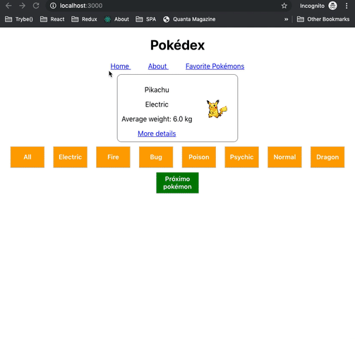

# ATIVIDADES DE FIXAÇÃO

Para iniciar estas atividades basta fazer um `npm install` para instalar as dependências da aplicação.

Feito isso, vamos as atividades!

## ATIVIDADE 01

Torne a aplicação navegável, encapsulando o que é retornado pelo `App` dentro do componente `BrowserRouter`.

## ATIVIDADE 02

Crie uma rota para o componente `Home`, utilizando um `Route` que mapeia o caminho de URL _"/"_ para `Home`

## ATIVIDADE 03

Adicione uma rota que mapeie o caminho de URL _"/about"_ para o componente `About`. Acesse `http://localhost:3000/about` para ver se o componente `About` foi renderizado!

## ATIVIDADE 04

Legal, o componente `About` foi renderizado, mas o componente `Home` foi também, o que não era desejado para o nosso caso. Altere a forma como a correspondência de caminho da URL está sendo feita para renderizar `Home`, de modo que `Home` **somente** seja renderizado se o caminho da URL for **exatamente** igual a _"/"_.

## ATIVIDADE 05

Por fim, adicione uma rota que mapeie o caminho de URL _"/users"_ para o componente `Users`. Acesse `http://localhost:3000/users` para ver se **somente** o componente `Users` foi renderizado.

## ATIVIDADE 06

Agora que as rotas, adicione dentro de `BrowserRouter` uma lista contendo 3 links:

- Um link que aponte para o caminho de URL _"/"_ contendo o texto `Home`;
- Um link que aponte para o caminho de URL _"/about"_ contendo o texto `About`;
- Um link que aponte para o caminho de URL _"/users"_ contendo o texto `Users`.

_*OBS*_: averígue que os links estão atualizando a URL do seu browser quando são clicados.

## ATIVIDADE 07

Altere o componente `Users` para poder fazer o exercício a seguir.

```
import React, { Component } from 'react';

class Users extends Component {
  render() {
    const { greetingsMessage } = this.props;
    return (
      <div>
        <h2>Users</h2>
        <p> {greetingsMessage}, My awesome Users component </p>
      </div>
    );
  }
}

export default Users;
```

## ATIVIDADE 08

No componente `App` há uma rota que renderiza o componente `Users`. Altere a forma como ela renderiza o componente `Users`, passando para ele a **prop** `greetingsMessage` com o valor igual a _"Good Morning"_. Lembre-se de usar a **prop** correta no `Route`!

## ATIVIDADE 09

Agora, para fixar uso de URL com parâmetros, altere a rota, definindo o parâmetro chamado **id**. Depois, altere o componente `Users`, de modo que mostre no parágrafo o valor recebido para o parâmetro **id**. Teste se está funcionando invocando as urls `localhost:3000/users/10`, `localhost:3000/users/11` e `localhost:3000/users/100`, por exemplo.

Daqui para frente, utilize o componente `Switch`.

## ATIVIDADE 10

No componente `App`, você deve possuir 3 rotas: uma para renderizar o componente `Home`, outra para renderizar `About`, e outra para renderizar `Users`, sendo que a última faz uso de parâmetro de URL. Encapsule essas 3 rotas em um componente `Switch` e ordene as rotas do mais específico para o mais genérico, começando de cima.

Para os próximos exercícios, utilize o componente `Redirect`.

## ATIVIDADE 11

Adicione, no diretório **src**, um componente chamado `StrictAccess`. Como o próprio nome diz, esse componente é de acesso restrito, e ele deve receber um objeto **user** como props. Se **username** e **password** de **user** for _"joao"_ e _"1234"_, respectivamente, o componente `StrictAccess` renderiza um parágrafo que diz _"Welcome joao!"_. Caso **username** ou **password** não sejam os valores esperados, o componente precisa gerar um alerta dizendo _"Access denied"_ e redirecionar quem usa sua aplicação para a página principal.

## ATIVIDADE 12

Adicione no componente `App` um link que aponte para o caminho de URL _"/strict-access"_ contendo o texto `Strict Access`.

## ATIVIDADE 13

Adicione no componente `App` uma rota que mapeie o caminho de URL _"/strict-access"_ para o componente `StrictAccess`. Para poder testar o fluxo de autenticação, passe para a prop **user** de `StrictAccess` diferentes valores para as propriedades **username** e **password**.

# EXERCÍCIO

Para este exercício você poderá usar a sua Pokédex criada em exercícios anteriores (bloco 11). Para isso, substitua a pasta src do repositório deste exercício.

Nesse repositório ja foi instalado o `react-router-dom`, só é necessário executar `npm install` uma vez dentro da pasta raiz para utilizá-lo.

E vamos aos exercícios...

## EXERCÍCIO 01

Ao carregar a aplicação no caminho de URL _"/"_, é preciso que seja mostrada a Pokédex.

## EXERCÍCIO 02

Adicione um link de navegação para o pokémon sendo mostrado pela Pokédex, de forma que quem usar a aplicação consiga clicar no link para ver mais detalhes do pokémon em questão. O nome do caminho da URL fica a seu critério. Lembre-se de que é preciso passar para a URL um identificador do pokémon, de forma que cada pokémon seja unicamente associado com o caminho de URL. Ou seja, se você quer que os detalhes de um pokémon se encontrem no caminho de URL _'/pokemons'_, você precisa passar para esse caminho um parâmetro de URL para que somente um pokémon seja visualizado. Todo pokémon tem um **id** na Pokédex, logo você poderia usá-lo como parâmetro de URL para permitir que quem usar sua aplicação consiga acessar detalhes do pokémon _'Pikachu'_ via caminho de URL _'/pokemons/25'_, onde **25** é o **id** do _'Pikachu'_.

## EXERCÍCIO 03

Crie um componente `PokemonDetails` para ser usado na visualização de mais detalhes do pokémon no passo anterior. É preciso que sejam mostradas as seguintes informações:

- Nome do pokémon;
- Tipo do pokémon;
- Peso do pokémon, com sua devida medida de peso;
- Sumário informativo a respeito do pokémon;
- Mapa(s) que mostra(m) as possíveis localizações do pokémon.

## EXERCÍCIO 04

Adicione um conjunto fixo de links de navegação no topo de sua aplicação, de forma que ele esteja **sempre** disponível para quem fizer uso. De início, adicione um link que leve quem usa sua aplicação de volta para a Pokédex.

## EXERCÍCIO 05

Crie um componente `About` para ser usado na visualização que explica brevemente o que é uma Pokédex, com alguma imagem ilustrativa. Use esta [página](https://bulbapedia.bulbagarden.net/wiki/Pok%C3%A9dex) como inspiração.

## EXERCÍCIO 06

Adicione no conjunto fixo de links de navegação um link que permita levar quem usa sua aplicação para a visualização de explicação da Pokédex.

## EXERCÍCIO 07

Crie um componente `NotFound`, de forma que **somente** ele seja renderizado caso o caminho atual da URL da aplicação não corresponda a rota alguma definida anteriormente.

Segue uma sugestão de implementação da aplicação, que se baseia na solução da Pokédex com estado que você precisou fazer anteriormente, com todos os requisitos bônus feitos. Nessa sugestão não estão implementados os requisitos bônus referentes ao exercício de hoje; eles ficarão a cargo da sua imaginação para implementá-los:



## BÔNUS

Agora que você tem uma aplicação Pokédex navegável, que tal encarar estes bônus?

1. Permita que um pokémon consiga ser favoritado dentro de sua visualização de mais detalhes. Uma vez favoritado, adicione algum indicativo visual, de forma que quem vir o pokémon saiba que ele foi favoritado. O indicativo de que o pokémon foi favoritado precisa também aparecer na página principal, que mostra a Pokédex;

2. Crie uma visualização que mostre somente os pokémons favoritados e torne-a acessível para quem a usar, criando um link para ela no conjunto fixo de links que você fez anteriormente;

3. Salve os pokémons favoritados no localStorage e recupere-os quando a aplicação for inicializada.
